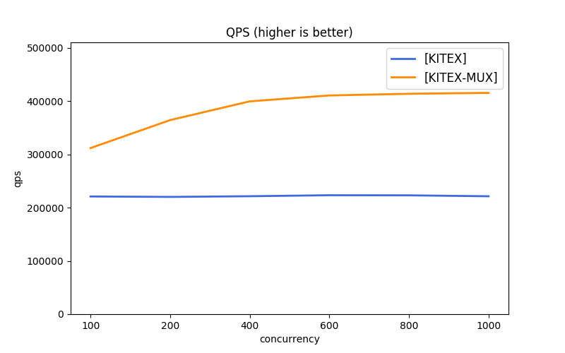
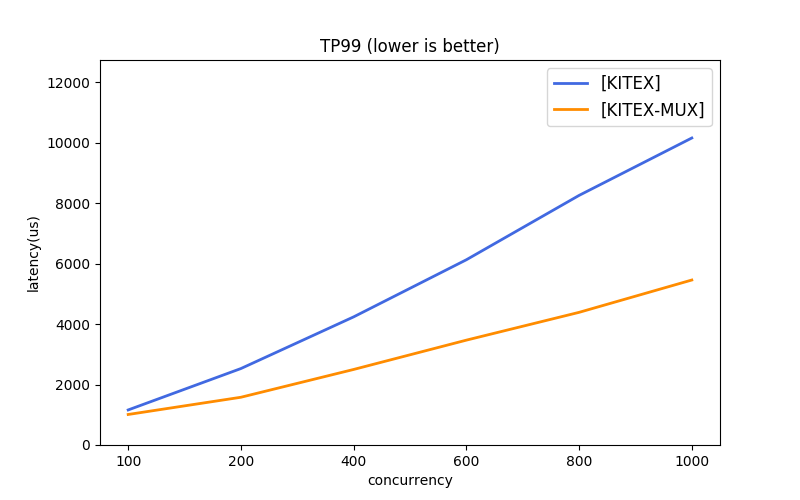
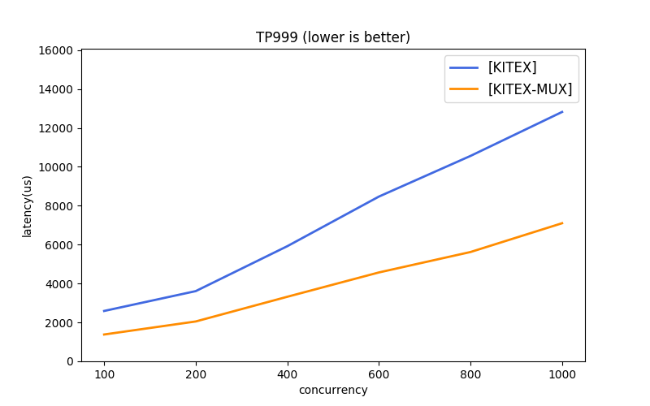
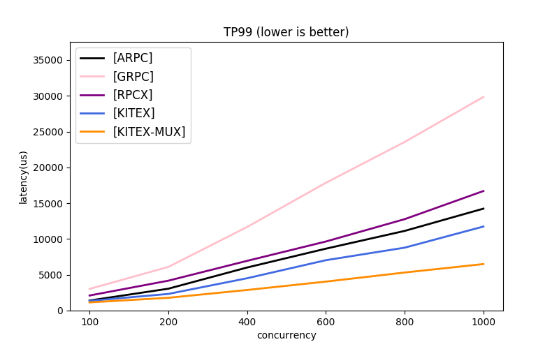
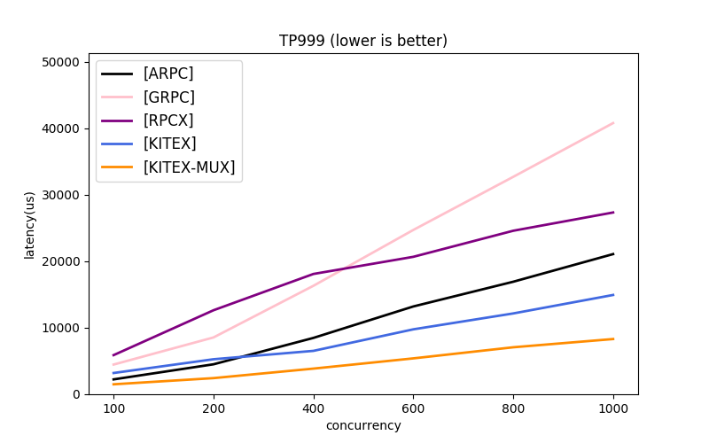
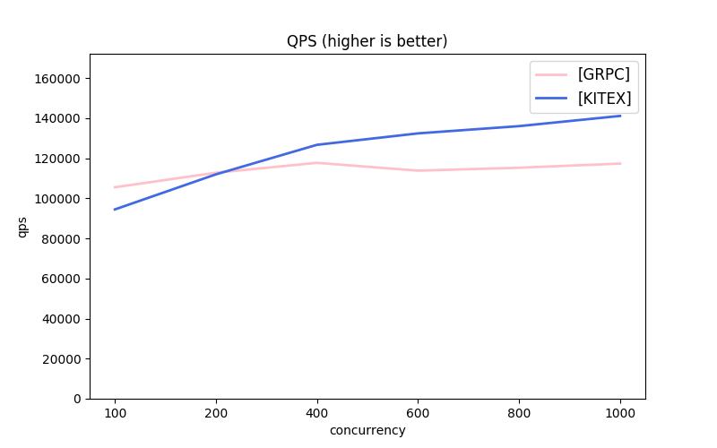
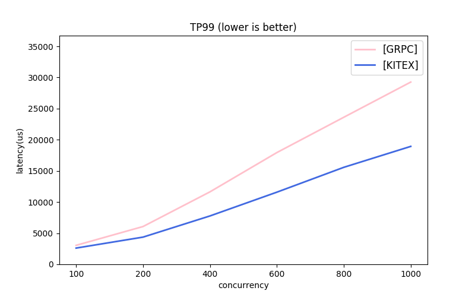

# kitex-benchmark

本项目展示了 [kitex][kitex] 的几种简单用法, 并提供了若干对比项目。

由于不同框架使用的 协议、传输模式等 存在差异，不能强行拉齐。[kitex][kitex] 给出了几种简单的组合，可供参考。

1. [kitex][kitex]:
    - 多协议：[thrift][thrift] (推荐)、[protobuf][protobuf]
    - 多传输模式：长连接池(推荐)、连接多路复用(mux)
2. 对比项目:
   - [thrift][thrift] 方向，暂时没有找到较为流行的对比框架，后续可以添加。
   - [protobuf][protobuf] 方向，提供了 [grpc][grpc]、[rpcx][rpcx] 作为对比项目(均使用连接多路复用)。

## 使用说明

### 同机压测

执行前请先确认满足[环境要求](#环境要求)。

#### Thrift

```bash
./scripts/benchmark_thrift.sh
```

#### Protobuf

```bash
./scripts/benchmark_pb.sh
```

#### GRPC

```bash
./scripts/benchmark_grpc.sh
```

### 跨机压测

同机回环压测时数据并未真正进入网卡，未能真实模拟线上服务情况。所以也提供了 Client 与 Server 分别部署执行的方式。

但是需要注意的是，如果执行机器上拥有超过 taskset 设置的核心，网络包会通过 softirq 借道其他未被 taskset 控制的 ksoftirqd 内核线程，进而享受了其他 CPU 的计算。所以需要严格的压测数据时，推荐使用和 taskset 一致的机器配置，或是删除 taskset。

#### Thrift

```bash
# host A
./scripts/run_thrift_servers.sh

# host B
./scripts/run_thrift_clients.sh
```

#### Protobuf

```bash
# host A
./scripts/run_pb_servers.sh

# host B
./scripts/run_pb_clients.sh
```

#### GRPC

```bash
# host A
./scripts/run_grpc_servers.sh

# host B
./scripts/run_grpc_clients.sh
```

### 压测数据对比

压测日志与对应 csv 结果会被输出在 ./output 目录下，默认以时间命名（如果指定了 REPORT 环境变量，会以该变量命名），例如:

```bash
$ scripts/benchmark_thrift.sh
$ ls output/
2021-12-13-21-40.log # raw output log
2021-12-13-21-40.csv # processed data

$ REPORT=feat-gopool scripts/benchmark_thrift.sh
$ ls output/
feat-gopool.log # raw output log
feat-gopool.csv # processed data
```

计算两次压测之间的 diff，输出结果为当前的数据加上变化的百分比值:

```bash
# Usage: python3 ./scripts/reports/diff.py baseline.csv current.csv

python ./scripts/reports/diff.py output/2021-12-13-21-40.csv output/2021-12-13-21-44.csv

# output:
# [KITEX-MUX]   100            1024           275604.66(+0.4%)     1.13(+0.0%)     2.01(-0.5%)
# [KITEX]       100            1024           218999.03(-0.4%)     1.28(-3.0%)     3.73(-2.1%)
```

### Profiling

由于默认压测参数会比较迅速完成一次压测，为了获得更长采集时间，可以手动在 `./scripts/env.sh` 中调整压测参数 n 大小。

#### Profiling Client

```bash
go tool pprof localhost:18888/debug/pprof/{pprof_type}
```

#### Profiling Server

不同 server 的 port 映射参见相应脚本，如:

```bash
cat ./scripts/benchmark_pb.sh

# ...
repo=("grpc" "kitex" "kitex-mux" "rpcx" "arpc" "arpc-nbio")
ports=(8000 8001 8002 8003 8004 8005)
```

获取到对应 server 端口号后，执行：

```bash
go tool pprof localhost:{port}/debug/pprof/{pprof_type}
```

### 更多场景测试

修改 `./scripts/env.sh` 文件：

```bash
# 发送压测请求数
n=5000000
# 请求体大小
body=(1024 5120)
# 并发度
concurrent=(100 200 400 600 800 1000)
# server handler sleep 时间(/ms)，默认为 0
sleep=0
```

## 环境要求

- OS: Linux
  * 默认依赖了命令 `taskset`, 限定 client 和 server 运行的 CPU; 如在其他系统执行, 请修改脚本。
- CPU: 推荐配置 >=20核, 最低要求 >=4核
  * 压测脚本默认需要 20核 CPU, 具体在脚本的 `taskset -c ...` 部分, 可以修改或删除。

## 参考数据

相关说明:

该压测数据是在调用端有充分机器资源**压满服务端**的情况下测试，更侧重于关注服务端性能。后续会提供调用端性能数据情况。

### 配置

* CPU:    Intel(R) Xeon(R) Gold 5118 CPU @ 2.30GHz
    * 运行限定 server 4-CPUs, client 16-CPUs
* OS:     Debian 5.4.56.bsk.1-amd64 x86_64 GNU/Linux
* Go:     1.17

### 数据 (echo size 1KB)

- [Thrift Raw Data](scripts/reports/pb.csv)
- [Protobuf Raw Data](scripts/reports/pb.csv)
- [GRPC Raw Data](scripts/reports/grpc.csv)

#### Thrift





#### Protobuf





#### GRPC





[kitex]: https://github.com/cloudwego/kitex
[grpc]: https://github.com/grpc/grpc
[rpcx]: https://github.com/smallnest/rpcx
[thrift]: https://thrift.apache.org
[protobuf]: https://developers.google.com/protocol-buffers/docs/gotutorial
